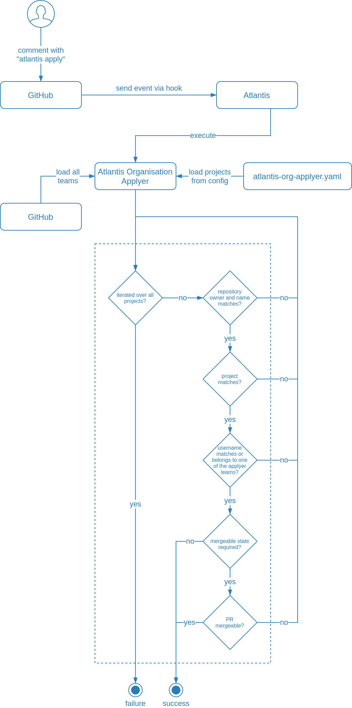

# Atlantis Organisation Applyer

When working with Atlantis on a bigger project (multiple GitHub repositories) a need arose to give `apply` permissions to more people in the organisation.

This project provides a solution (in form of a binary) which allows to grant `apply` permissions to GitHub users and teams for specific repository and Atlantis project pairs.

## Atlantis Integration

- add `atlantis-org-applyer` binary to the VM image or Docker image:

  ```bash
  version=1.0.1
  curl -SsLO "https://github.com/czerasz/atlantis-org-applyer/releases/download/v${version}/atlantis-org-applyer-v${version}-linux-amd64"
  curl -SsLO "https://github.com/czerasz/atlantis-org-applyer/releases/download/v${version}/atlantis-org-applyer-v${version}.sha256sum"
  grep "atlantis-org-applyer-v${version}-linux-amd64" "atlantis-org-applyer-v${version}.sha256sum" | sha256sum -c
  chmod u+x "atlantis-org-applyer-v${version}-linux-amd64"
  ```

- mount configuration at `/etc/atlantis/atlantis-org-applyer.yaml`

- configure Atlantis workflow in repo config file (`/etc/atlantis/repos.yaml`):

  ```yaml
  ---
  ...
  workflows:
    standard:
      plan:
        steps:
        - env:
            name: GITHUB_BASE_URL # for GitHub Enterprise
            command: echo "https://${ATLANTIS_GH_HOSTNAME}/api/v3/"
        - env:
            name: GITHUB_TOKEN
            command: echo "${ATLANTIS_GH_TOKEN}"
        - env:
            name: CONFIG_PATH
            value: /etc/atlantis/atlantis-org-applyer.yaml
        - run: atlantis-org-applyer
        - apply
  ```

## Sample Configurations (`atlantis-org-applyer.yaml`)

- allow `czerasz` user to apply every PR on `czerasz/repo-name` repository:

  ```yaml
  projects:
  - repo_owner: czerasz
    repo_name: repo-name
    atlantis_project: '.*' # allow every Atlantis project
    applyers:
    - name: czerasz
  ```

- allow `atlantis` team to apply every PR on `czerasz/repo-name` repository:

  ```yaml
  projects:
  - repo_owner: czerasz
    repo_name: repo-name
    atlantis_project: '.*' # allow every Atlantis project
    applyers:
    - name: atlantis
      type: team
  ```

  > **NOTE**
  >
  > `atlantis` represents the GitHub team slug

- allow `atlantis` team to apply every PR, on every repository in the `czerasz` organisation for projects prefixed with `dev` or `test`:

  ```yaml
  projects:
  - repo_owner: czerasz
    repo_name: '.*'
    atlantis_project: '^(dev|test).*'
    applyers:
    - name: atlantis
      type: team
  ```

- allow `atlantis-ninjas` team to apply every PR, on `czerasz/databases` repository for projects prefixed with `prod` only if the PR is in [mergeable state](https://www.runatlantis.io/docs/server-side-repo-config.html#requiring-pr-is-mergeable-before-apply):

  ```yaml
  projects:
  - repo_owner: czerasz
    repo_name: '^databases$'
    atlantis_project: '^prod.*'
    required_mergeable: true
    applyers:
    - name: atlantis-ninjas
      type: team
  ```

  > **NOTE**
  >
  > Remember to exclude `mergeable` from `apply_requirements`

## Configuration Environment Variables

| Variable Name | DEscription | Required | Default |
| --- | --- | -- | --- |
| `GITHUB_BASE_URL` | Custom URL when used with GitHub Enterprise installation | yes | `""` |
| `GITHUB_TOKEN` | GitHub token of API user | yes | `-` |
| `BASE_REPO_OWNER` | Owner of the repository that the pull request will be merged into, ex. `runatlantis` | yes | `-` |
| `BASE_REPO_NAME` | Name of the repository that the pull request will be merged into, ex. `atlantis` | yes | `-` |
| `PULL_NUM` | Pull request number or ID, ex. `2` | yes | `-` |
| `PROJECT_NAME` | Name of the project configured in `atlantis.yaml` | yes | `-` |
| `USER_NAME` | Username of the VCS user running command, ex. `czerasz` | yes | `-` |
| `CONFIG_PATH` | Configuration file used by `atlantis-org-applyer` | yes | `atlantis-org-applyer.yaml` |
| `LOG_LEVEL` | Log level | no | `debug` |

> **NOTE**
>
> Environment variable names were choosen to match as close as possible variables [provided by Atlantis](https://www.runatlantis.io/docs/custom-workflows.html#reference)

## Overview


